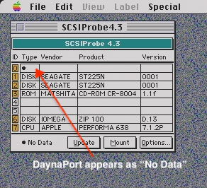

# DaynaPort SCSI/Link Ethernet
PiSCSI has the ability to emulate a DaynaPort SCSI/Link device. This allows for a host to connect to a local area network through the Raspberry Pi's network connection (either wired or wireless)
<table>
<tr>
<td><a href="images/rascsi_daynaport_wired.png"></a>
<td><a href="images/rascsi_daynaport_wireless.png"></a>
</tr>
</table>

The instructions for the wired network use case assumes that you're using a DHCP server (which is typical of a home network). The wireless use case will create an isolated subnet with manual IP assignment. If you're using manual IP addresses for your wired network, you may try to tweak the wireless example.

#  Raspberry Pi Setup
Depending upon which use case matches your situation, the Raspberry Pi configuration will be slightly different.

## Automated Setup

- Download and install latest version of PiSCSI by following the [[setup instructions]].

- Run the network bridge setup script for wired or wireless:

```
# Scripted network configuration:
./easyinstall.sh # Select option 6 to configure wired, and 7 to configure wireless bridge
```

- Let the Pi reboot, and attach a DaynaPORT adapter to your PiSCSI as instructed in the script

## Manual Setup
If you're *not* using easyinstall.sh to configure the network bridge, you can follow the manual steps below.

### Wired Raspberry Pi Setup
*Only use this section if you didn't use easyinstall.sh to configure the bridge, and your Raspberry Pi is connected to a wired network that uses DHCP to assign addresses*

In this section, we're going to reconfigure the network so that eth0 is just an interface to the outside world, but does not have any "Layer 3" functions. 
|Before   | After  |
|---------|--------|
| <a href="images/daynaport_wired_network_before.png"></a>        |  <a href="images/daynaport_wired_network_configured.png"></a>      |

- Set up linux networking: In this step we will be re-configuring the network to use a bridge device named `rascsi_bridge`

  - Copy the bridge configuration to `/etc/network/interfaces.d/`
  
  ```sudo cp ~/PiSCSI/src/raspberrypi/os_integration/rascsi_bridge /etc/network/interfaces.d/```

  - Modify the `/etc/dhcpcd.conf` file to add the following line at the bottom
  
  ```denyinterfaces eth0```

- Reboot the Pi

**NOTE**: Your IP address may change after the reboot!

- After the reboot, run `ip addr show`. You should see that eth0 does NOT have an IP address, and that rascsi_bridge DOES have an IP address assigned.

<a href="images/daynaport_bridge_config.png"></a>

- When you run `brctl show`, you should also see that there is a rascsi_bridge created with eth0 connected to it.


```
pi@rascsi:~ $ brctl show 
bridge name     bridge id          STP enabled   interfaces
rascsi_bridge   8000.869bacd8de6f  no		         eth0
```

- After you create/attach the daynaport in Rascsi, you should be able to see a "piscsi0" interface attached to the bridge. Run 'brctl show' on Linux to validate this. (Note the formatting may be garbled on your terminal)
```
pi@rascsi:~ $ brctl show 
bridge name     bridge id          STP enabled   interfaces
rascsi_bridge   8000.869bacd8de6f  no		         eth0
                                                 piscsi0
```


### Wireless Raspberry Pi Setup
*Only use this section if you didn't use easyinstall.sh to configure the network bridge, and your Raspberry Pi is connected to a wireless network or you want to use [Network Address Translation \(NAT\)](https://en.wikipedia.org/wiki/Network_address_translation)*

The goal of this section is to create the network bridge with a static IP address, and then configure NAT using iptables rules to share the connection with the DaynaPORT interface.

- Set up your network on the Raspberry Pi. Make sure you can connect to the internet with a web browser, etc.
- Decide on network interface, IP addresses and netmask to use for your setup. This example assumes wlan0, base address 10.10.20.X and netmask 255.255.255.0 (24)

- Edit /etc/sysctl.conf and uncomment
```
net.ipv4.ip_forward=1
```

- Set up iptables by first clearing any existing rules, then configure masquerading on wlan0
```
sudo iptables --flush
sudo iptables -t nat -F
sudo iptables -X
sudo iptables -Z
sudo iptables -P INPUT ACCEPT
sudo iptables -P OUTPUT ACCEPT
sudo iptables -P FORWARD ACCEPT
sudo iptables -t nat -A POSTROUTING -o wlan0 -s 10.10.20.0/24 -j MASQUERADE
```

- Make iptables rules permanent (answer yes to the first question; second question doesn’t matter)
```
sudo apt-get install iptables-persistent
```

Reboot the Pi

Note that unlike the wired configuration above, PiSCSI will stand up the rascsi_bridge interface automatically when you attach the DaynaPORT device, so there is no need to copy over the interface config file to interfaces.d .

On the Mac side, in the TCP/IP or MacTCP control panel choose Manual and input:
* IP address 10.10.20.2
* Network mask 255.255.255.0
* Router 10.10.20.1
* Name server can be any DNS server; [Google's Public DNS servers](https://developers.google.com/speed/public-dns) work well for this purpose 

**Note:** It’s recommended to specify at least two DNS addresses

**Note:** AppleTalk/DDP won't work to communicate with other devices on the network with this configuration, but TCP will work fine.


# Attach a DaynaPORT adapter to your PiSCSI configuration

There are four ways to accomplish this:
1. Launch 'rascsi' with parameters on the command line (when not running as a service)
2. Edit the rascsi.service configuration to attach devices on launch (when running as a service)
3. Use 'scsictl' to dynamically attach the device on a running rascsi instance
4. Use the [[web interface]] to attach the device

Note that by default, the DaynaPORT device will launch with parameters 'eth0,wlan0' meaning it will attempt to use eth0 first, and if unavailable then wlan0.  Also, note that the default IP address / netmask is 10.10.20.1/24.  So for most usecases, if you follow the automated process and use the default values, you don't have to specify any parameters when attaching the DaynaPORT device and it should work out of the box.

Ex. with rascsi / wired / DHCP, PiSCSI *not* running as a service
```sudo rascsi -ID 6 -t scdp eth0```

Ex. with scsictl / wired / DHCP, PiSCSI already running
```scsictl -i 6 -c attach -t scdp -f eth0```

Ex. with rascsi / wireless / static IP, PiSCSI *not* running as a service
```sudo rascsi -ID 6 -t scdp wlan0:10.10.20.1/24```

Ex. with scsictl / wireless / static IP, PiSCSI already running
```scsictl -i 6 -c attach -t scdp -f wlan0:10.10.20.1/24```


## **(Optional)** Configure PiSCSI to start up with your DaynaPORT configuration

Here you have two options.  Either have the PiSCSI Web UI read your *default* configuration file on startup, or hard code the launch parameters in the rascsi.service ExecStart argument.  The latter is more permanent, while the former can be managed more easily through the Web UI.  Also note that the Web UI configuration will override whatever is defined in rascsi.service.

- Web UI configuration option:
Once you've attached your DaynaPORT device with just the right parameters, you can save that as a PiSCSI Web UI configuration file.  If you name it *default* (~/.config/rascsi/default.json) that configuration will be loaded when the Web UI starts up for ultimate convenience!

- rascsi.service ExecStart option:
Modify your service startup script to automatically add the DaynaPort at startup. To do this, open `/etc/systemd/system/rascsi.service` with a text editor. Modify the ExecStart line to add the ID and device. For example:

```ExecStart=/usr/local/bin/rascsi -ID 6 -t scdp eth0```

- If you modified the rascsi.service file, you will need to run `sudo systemctl daemon-reload` and `sudo service rascsi restart`


#  Macintosh Setup Instructions
The ***ultimate*** classic Mac networking guide is available on [AppleFool.com](http://www.applefool.com/se30/)

There are two primary methods to configure TCP/IP on vintage Macs:
- "Classic Networking" (MacTCP)
- Open Transport

Open transport is recommended if you're not sure which one you want to use.

## Classic Networking (MacTCP)
Note: MacTCP does NOT support DHCP out of the box, so if you use stock MacTCP you will have to assign a static IP address on your Mac. There are patches and instructions elsewhere on the Web if you want to use DHCP with MacTCP.

MacTCP is your only option if you want to get your Mac with a 68000 or 68020 CPU online, or if you're running System Software 7.0.1 or earlier.

*The following instructions have been tested on System Software 6.0.7 and 7.1.1 Pro.

- Download and install [Network Software Installer 1.5.1](https://macintoshgarden.org/apps/network-software-installer-version-11)
- Download [MacTCP 2.0.6](https://macintoshgarden.org/apps/mactcp-206) and apply the unofficial 2.1 patch, then move it into the Extensions folder (SSW 7.0+) or in the root of the System Folder (SSW 6.0.x or earlier)
- Download and install the [DaynaPort 7.5.3 Drivers](https://macintoshgarden.org/apps/daynaport-drivers)
- Reboot your Macintosh
- Open up the MacTCP control panel and configure it with a static IP address matching the rascsi_bridge configuration on your PiSCSI
-- Example below for when rascsi_bridge is set to 10.10.20.1, and using Google Public DNS servers
- Reboot your Macintosh again
- Test your network connection with [MacTCP Ping](https://macintoshgarden.org/apps/mactcp-ping) by f.e. pinging a DNS server (8.8.8.8)


## Open Transport
*(Note the following instructions were written for MacOS 7.1 and 7.5. There may be slight differences on other versions)*

- Download and install [Open Transport 1.3](https://macintoshgarden.org/apps/open-transport-13-gold-master)
- Download and install the [DaynaPort 7.5.3 Drivers](https://macintoshgarden.org/apps/daynaport-drivers)
  - Mirrors: [Github](drivers/daynaport-installer-753.hqx), [VintageApple.org](https://vintageapple.org/macdrivers/network.shtml)
  - Alternative [DaynaPort 7.7.1 Drivers](http://www.bitsavers.org/pdf/apple/scsi/dayna/daynaPORT/DaynaPORT_7.7.1.iso)

| Step | Screenshot |
| --- | --- |
| When you run the DaynaPort installer, it should auto-detect the SCSI/Link device. If not, your installation may not work correctly. | <a href="images/daynaport_installer_2.jpg"></a> |
| It is recommended to pick the _Custom Install_ or _Customize_ option, and then choose to install _DaynaPORT SCSI/Link_ only from the list. This avoids a situation where the Installer tries to overwrite newer versions of f.e. AppleTalk and fails with an error. | <a href="images/daynaport_installer_custom.jpg"></a> |
| You may get a warning about a later version of a file with a corrupted name. You can ignore this. | <a href="images/daynaport_installer_3.jpg"></a> |
| Once the install is complete, reboot the Macintosh. | <a href="images/daynaport_installer_4.jpg"></a> |

**Tip: A bootstrap .HDA image with all of the needed drivers is available [Macintosh Garden](https://macintoshgarden.org/apps/rascsi-68kmla-edition)**

**Optional** Its recommended to also install the diagnostics utilities. These can help in troubleshooting. To install these, run the `diagnostics.sea` file included with the driver installer.

## Software Diagnostics
This application will verify that you have the drivers correctly installed and that you are communicating with the virtual DaynaPort SCSI/Link. When you launch the software diagnostics tool, you should see something resembling this output:

<a href="images/daynaport_software_diagnostics.jpg"></a>

## Hardware Diagnostics
The Hardware Diagnostics tool will disable the DaynaPort interface. **You MUST reboot your Mac after running this utility.** Any ongoing network communication will be interrupted.

When you first launch the application, it will warn you that you MUST reboot after running it. 

<a href="images/daynaport_hw_diagnostics_warning.jpg"></a>

After you click Continue, it may take a few seconds for the diagnostics to run. When they complete, you should see something resembling this:

<a href="images/daynaport_hw_diagnostics_output.jpg"></a>

## OTTool

Another excellent troubleshooting tool it Apple's [OTTool 1.2.1](https://macintoshgarden.org/sites/macintoshgarden.org/files/apps/OTTool_1.2.1.sit).  It requires Open Transport 1.3 to be installed, provides detailed information about the network interface, and has several built-in features for domain name resolution, ping, traceroute, etc.

One way to know that your DaynaPort interface is set up correctly locally, is that OTTool shows that the interface has been assigned an IP address. That helps you eliminate other problems such as bridge or NAT configuration on the PiSCSI host.

#  Atari ST/TT/Falcon Setup Instructions

The DaynaPort SCSI/Link emulation works with the MiNT drivers for the Atari ST. Some instructions for setting this up are available on the archived [Anodyne Software web page](https://web.archive.org/web/20180915114613/http://www.anodynesoftware.com/ethernet/main.htm).

See also [this thread on Atari-Forums](https://www.atari-forum.com/viewtopic.php?p=425264&sid=d98c89b8f40e228621e617964177ce27#p425264) with steps to a successful setup on an Atari TT system.

# Troubleshooting and limitations
- Right now, the DaynaPort SCSI/Link simulation is hard coded to use a specific MAC address. Only use one of these on any network at a time (for now)
- SCSIProbe can see that something is there, but only returns it as a dot. SCSIProbe doesn't understand the Inquiry response. (The real Daynaport is the same way)

<a href="images/daynaport_scsiprobe.jpg"></a>
- Most wifi routers will prevent multiple MAC addresses from using the same wifi radio. You will likely need to set up NAT on your Raspberry Pi to get this work.
- For debugging on a Mac, [AG Net Tools](https://macintoshgarden.org/apps/ag-net-tools) will be your best friend. It includes utilities that report the current network configuration, ping, trace route, etc. 

<a href="images/agnettools.png"></a>

# Other background Info

The current working copy of the DaynaPort SCSI Link command set is available here: [DaynaPort Command Set](./Dayna-Port-Command-Set).

## Dyanaport Pictures
<a href="images/DaynaPort_1.jpg"></a>
<a href="images/DaynaPort_2.jpg"></a>
<a href="images/DaynaPort_3.jpg"></a>
<a href="images/DaynaPort_4.jpg"></a>

The Farallon EtherMac is probably [identical to the DaynaPort SCSI/Link-T](https://68kmla.org/forums/topic/29592-farallon-ethermac-adapter/)


## Links:
- Tiny SCSI Hackaday project - https://hackaday.io/project/18974/logs?sort=oldest
- Tiny SCSI source code - https://bitbucket.org/tinyscsi/tinyscsiemulator/src/master/
- Dayna Port Pictures, software & docs - http://www.bitsavers.org/pdf/apple/scsi/dayna/daynaPORT/
- Users guide: https://www.apple.asimov.net/documentation/macintosh/DaynaPORT_Pocket_SCSI_Link_Users_Guide_Sep95.pdf
- Drivers: https://vintageapple.org/macdrivers/network.shtml
- Pictures of the inside of the device: https://goughlui.com/2013/07/28/tech-flashback-daynaport-scsilink-t/
- Archive.org Drivers: https://web.archive.org/web/19961102041429/http://www.dayna.com/Dayna/techsup/drivers.html

## Atari Links:
- "FreeMint" Driver Implementation: https://github.com/freemint/freemint/tree/master/sys/sockets/xif/daynaport
- Setup instructions: https://sites.google.com/site/probehouse/networking-the-atari/networking-the-atari-st


