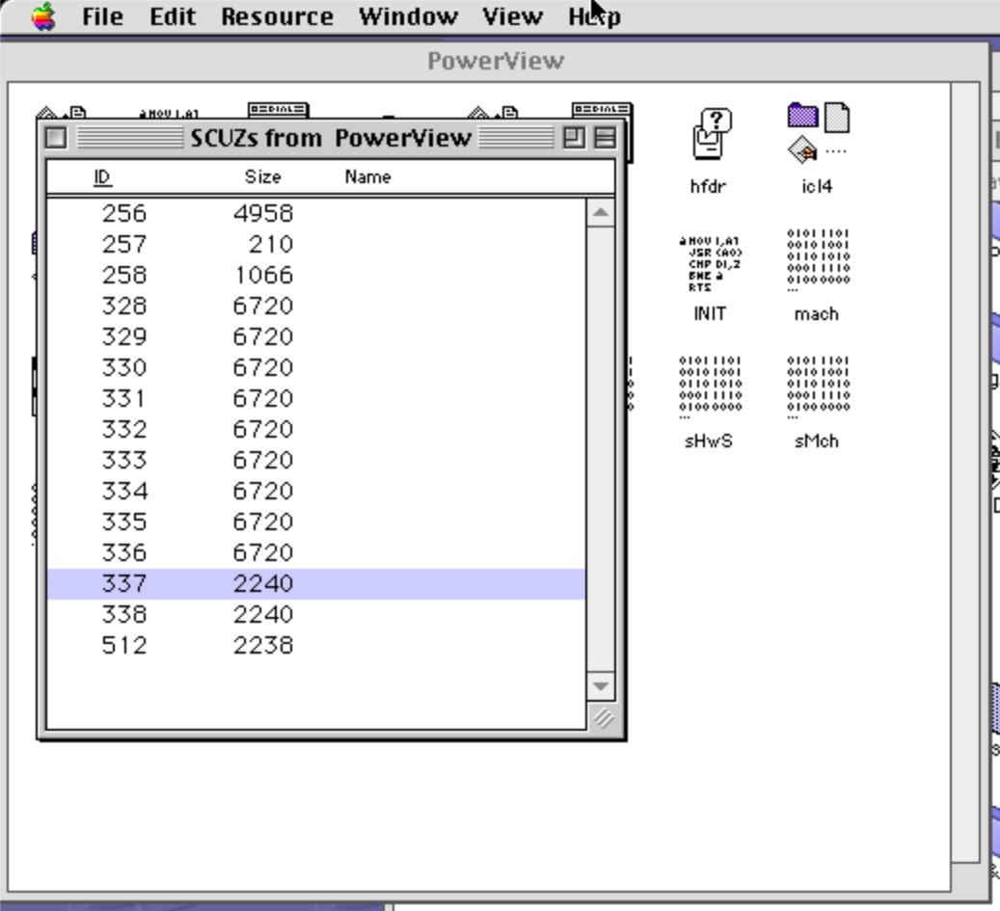

# Radius Powerview: SCSI Command Set

# SCOPE
This document applies to the following hardware devices:
- Radius Powerview (Model 825-0496-03 A)


and to the following firmware revisions:
- TBD

All numbers are expressed in hexadecimal, unless otherwise noted.

# COMMAND SET SUMMARY
The following is a list of the observed SCSI commands:

- 12    Inquiry
- C8    Read register or configuration?
- C9    Write register or configuration?
- CA    Write to frame buffer
- CB    Load Color Palette
- CC    **UNKNOWN**


## Inquiry (12)
Command:  `12 00 00 00 LL 00` (LL is data length)

Function: Perform a standard SCSI Inquiry command: reference the SCSI spec for further information

Type:     Input; reference the SCSI spec for the data returned

Sequence: Command->

Examples:

Command:  `12 00 00 00 01 00`
*Direct to status phase*


Command:  `12 00 00 00 05 00`
Data in:  `03 00 01 01 05 00

Command:  `12 00 00 00 4B 00`
Data in:  
```
00: 03000101 46000000 52414449 55532020
10: 506F7765 72566965 77202020 20202020
20: 56312E30 00000000 10002000 01000000
30: 00020000 00000300 00000004 00000000
40: 05000000 000643F9 0000FF
```

Command:  `12 00 00 00 24 00`
Data in:
```
00: 03000101 46000000 52414449 55532020
10: 506F7765 72566965 77202020 20202020
20: 56312E30
```

`00: 03000101 46000000 52414449 55532020`

 * Device Type: 3
 * Version: 1
 * Response Data format: 1
 * T10 Vendor ID: "`RADIUS  `"

`10: 506F7765 72566965 77202020 20202020`

 * Product Id: "`PowerView       `"
 
`20: 56312E30 00000000 10002000 01000000`

 * Product Revision: "V1.0"
 * Serial Number: `0000000010002000`

`30: 00020000 00000300 00000004 00000000`

`40: 05000000 000643F9 0000FF`

## **UNKNOWN** (C8) Read Register???
Command:  C8 00 00 AA AA 00 LL 00
 * LL = Length of reponse
 * AA = Address being read? Or ID of the data being requested?

Function: Poll data from the Powerview?

Seems to only have a few requests, with consistent responses. Potentially a way to read registers/data/information about the Powerview. Also appears to be the only command that transfers data TO the host.


Sequence: Command->Status->Data In->Status->Msg In

Examples:

Command: `C8 00 00 31 83 00 01 00`

Data in: `00`

Command: `C8 00 00 31 00 00 03 00`

Data in: `01 09 08`

Command: `C8 00 00 31 82 00 01 00`

Data in: `01`

**TODO: Try different monitors/devices to see if these responses change**

## **UNKNOWN** (C9) Write Register?
Command: `C9 00 00 21 81 00 LL 00`
* LL = Length in bytes

Function: ***Unknown at this time***

Type:     Input (Transitions to DATAOUT)

Sequence: Command->Data Out->Status->Msg In
Examples:

Command: `C9 00 00 31 00 00 03 00`
Data out: `00 00 00`

Command: `C9 00 00 32 82 00 01 00`
Data out: `00`

Command: `C9 00 00 21 81 00 04 00`
Data out: `00 01 01 01`

or

Data out: `00 01 00 00`

or

Data out: `01 01 01 00`

or

Data out: `00 01 01 00`

Command: `C9 00 00 21 81 00 04 00`
Data out: `00`

Command: `C9 00 00 21 82 00 01 00`
Data out: `01`

Command: `C9 00 00 38 00 00 01 00`
Data out: `02`

Command: `C9 00 00 32 86 00 01 00`
Data out: `3E`
C9 comes repeatedly during a long spurt at startup. 


## Write to frame buffer (CA)
`CA00095E 00010020 009E00`
`CAffffff wwwwhhhh ??????`

where
fffffff = offset into frame buffer
wwww = (x) width of update in bytes (Not sure which)
hhhh = (y) height of update in bytes (Not sure which)

### Full Frame Buffer transfer

|       |640x400   | 640x480    | 800x600   |
|-------|----------|------------|-----------|
| Black & White| `CA000000 00500190 000000` (0x80d7) | `CA000000 005001E0 000000` (0x99c2)  | `CA000000 00640258 000000` (0xf0b0)|
| 16 Colors (4 bit color) | `CA000000 01400190 000000` (0x203a0)| `CA000000 014001E0 000000` (0x267ee) | `CA000000 01900258 000000` (0x3c39a)|
| 256 Colors (8 bit color)  | `CA000000 02800190 000000` (0x40206) | `CA000000 028001E0 000000` (0x3f886) | `CA000000 03200258 000000` (0x78361)|

## Frame Buffer Update

Black & White
 * `CA000000 00500190 000000` (0x5d26) - 640x400
 * `CA00095E 00010020 009E00` (0x20) - 640x400
 * `CA00095E 00010020 009E00` (0x20) - 640x400
 * `CA000818 00040020 009800` (0x80) - 640x400
 * `CA000814 00050020 009600` (0xa2) - 640x400
 * `CA000814 00050020 009600` (0xa0) - 640x400
 * `CA000812 00050020 009600` (0xa1) - 640x400
 * `CA00076E 00050020 009600` (0xa2) - 640x400
 * `CA0007FC 00050020 009600` (0x9e) - 640x400
 * `CA000A7E 00050020 009600` (0xa5) - 640x400

640x480 bw
 * `CA000000 00020010 009C00` (0x20)
 * `CA00351E 00010020 009E00` (0x20)
 * `CA00365A 00030020 009A00` (0x60)
 * `CA003796 00050020 009600` (0xa3)
 * `CA003A0C 00050020 009600` (0xa0)
 * `CA003C82 00050020 009600` (0xa0)

800x600 bw
 * `CA000000 00020010 00C400` (0x20)
 * `CA01D238 00020004 00C400` (0x8)
 * `CA01D0A8 00030006 00C200` (0x12)
 * `CA01CF18 00030008 00C200` (0x18)
 * `CA01CD88 0003000A 00C200` (0x1e)

Function: Update the framebuffer

Currently guessing that this updates the framebuffer.
- The messages come at different sizes. Some huge, some tiny. 
- Where I *think* the screensaver was showing the screensaver (Pyro fireworks), it was sending mostly FFFFFFF, with a few zeros sprinkled throughout.
- I also think that a huge buffer of all F's was sent (approximately size 96D7 bytes). This happens to be approximately (640x480)/8 bits (with one bit color)

Type:     Input (Transitions to DATAOUT)

Maybe related to Figure 4-9 of https://fabiensanglard.net/nbajamte/t34010_user_guide.pdf

| <----- 32bit -----> | <--16 bit--> | <-- 16-bit --> |
|---------------------|--------------|----------------|
| Offset              | Y            | X              |

Origin is at top left of screen

Examples:

Command: `CA 00 00 00 00 50 01 E0`

Data out:
```
00: 55555555 55555555 55555555 55555555
10: 55555555 55555555 55555555 55555555
20: 55555555 55555555 55555555 55555555
30: 55555555 55555555 55555555 55555555
40: 55555555 55555555 55555555 55555555
50: AAAAAAAA AAAAAAAA AAAAAAAA AAAAAAAA
60: AAAAAAAA AAAAAAAA AAAAAAAA AAAAAAAA
70: AAAAAAAA AAAAAAAA AAAAAAAA AAAAAAAA
80: AAAAAAAA AAAAAAAA AAAAAAAA AAAAAAAA
90: AAAAAAAA AAAAAAAA AAAAAAAA AAAAAAAA
A0: 55555555 55555555 55555555 55555555
B0: 55555555 55555555 55555555 55555555
...
96A0: AAAAAAAA AAAAAAAA AAAAAAAA AAAAAAAA
96B0: AAAAAAAA AAAAAAAA AAAAAAAA AAAAAAAA
96C0:
```


Command: `CA 00 00 00 00 50 01 E0`

Data out:
```
00: 55555555 55555555 55555555 55555555
10: 55555555 55555555 55555555 55555555
20: 55555555 55555555 55555555 55555555
30: 55555555 55555555 55555555 55555555
40: 55555555 55555555 55555555 55555555
50: 5555AAAA AAAAAAAA AAAAAAAA AAAAAAAA
60: AAAAAAAA AAAAAAAA AAAAAAAA AAAAAAAA
70: AAAAAAAA AAAAAAAA AAAAAAAA AAAAAAAA
80: AAAAAAAA AAAAAAAA AAAAAAAA AAAAAAAA
90: AAAAAAAA AAAAAAAA AAAAAAAA AAAAAAAA
A0: AAAA5555 55555555 55555555 55555555
B0: 55555555 55555555 55555555 55555555
...
9660: 55555555 AAAAAAAA AAAAAAAA AAAAAAAA
9670: AAAAAAAA AAAAAAAA AAAAAAAA AAAAAAAA
9680: AAAAAAAA AAAAAAAA AAAAAAAA AAAAAAAA
9690: AAAAAAAA AAAAAAAA AAAAAAAA AAAAAAAA
96A0: AAAAAAAA AAAAAAAA AAAAAAAA AAAAAAAA
96B0: AAAAAAAA AA
```

Command: `CA 00 00 00 00 02 00 10 00 9C 00`

Data out: 
```
00: 5555AAAA 5555AAAA 5555AAAA 5555AAAA
10: 5555AAAA 5555AAAA 5555AAAA 5555AAAA
```

Command: `CA 00 D3 94 00 0E 00 64 00 84 00`
Dataout:
```
00: FFFFFFFF FFFFFFFF FFFFFFFF FFFFFFFF
10: FFFFFFFF FFFFFFFF FFFFFFFF FFFFFFFF
20: FFFFFFFF FFFFFFFF FFFFFFFF FFFFFFFF
30: FFFFFFFF FFFFFFFF FFFFFFFF FFFFFFFF
40: FFFFFFFF FFFFFFFF FFFFFFFF FFFFFFFF
50: FFFFFFFF FFFFFFFF FFFFFFFF FFFFFFFF
60: FFFFFFFF FFFFFFFF FFFFFFFF FFFFFFFF
70: FFFFFFFF FFFFFF7F FFFFFFFF FFFFFFFF
...
// There were some non-FF fields in this data
...
520: FFFFFFFF FFFFFFFF FFFFFFFF FFFFFFFF
530: FFFFFFFF FFFFFFFF FFFFFFFF FFFFFFFF
540: FFFFFFFF FFFFFFFF FFFFFFFF FFFFFFFF
550: FFFFFFFF FFFFFFFF FFFFFFFF FFFFFFFF
560: FFFFFFFF FFFFFFFF FFFFFFFF FFFFFFFF
570: FFFFFFFF FFFFFFFF FFFF
```

Command: `CA 00 00 00 00 50 01 E0 00 00 00`
Dataout: (Note that 640x480/8 = 38400 = 0x9600) 
```
00: FFFFFFFF FFFFFFFF FFFFFFFF FFFFFFFF
10: FFFFFFFF FFFFFFFF FFFFFFFF FFFFFFFF
...
96C0: FFFFFFFF FFFFFFFF FFFFFFFF FFFFFFFF
96D0: FFFFFFFF FFFFFF
```
*This block was mostly 0xFF. There were a couple non-FF values, but those could have been hiccups with the capture software*


Lots of udpates.... (Maybe screensaver?)

Command: `CA011AE6 00020003 009C00`
Dataout: `FE7FFF3F FF3F`

Command: `CA011EA8 00010003 009E00`
Dataout: `FFFFFF`

Command: `CA011A46 00020002 009C00`
Dataout: `FE7FFE7F`

Command: `CA011D68 00010003 009E00`
Dataout: `FFFFFF`

Command: `CA011906 00020003 009C00`
Dataout: `FE7FFE7F FE7F`

Command: `CA011C28 00010003 009E00`
Dataout: `FFFFFF`

Command: `CA0117C6 00020003 009C00`
Dataout: `FE7FFE7F FE7F`

Command: `CA011AE6 00020003 009C00`
Dataout: `FFFFFFFF FFFF`

Command: `CA011686 00020003 009C00`
Dataout: `FE7FFE7F FE7F`

Command: `CA011A46 00020002 009C00`
Dataout: `FFFFFFFF`

Command: `CA0115E6 00020002 009C00`
Dataout: `FE7FFE7F`


### Work
Guess:   `CA <ADDRESS>.  <Length?>

Command: `CA 00 00 00 00 50 01 E0` - Size: 96C0

Command: `CA 00 00 00 00 50 01 E0` - Size: 96B4

Command: `CA 00 00 00 00 02 00 10 00 9C 00` - Size: 0020

Command: `CA 00 D3 94 00 0E 00 64 00 84 00` - Size: 57A0

Command: `CA 00 00 00 00 50 01 E0 00 00 00` - Size: 96D7 


Command: `CA011EA8 00010003 009E00` - Size 3

Command: `CA011D68 00010003 009E00` - Size 3

Command: `CA011A46 00020002 009C00` - Size 4

Command: `CA011C28 00010003 009E00` - Size 4

Command: `CA011906 00020003 009C00` - Size 6

Command: `CA0117C6 00020003 009C00` - Size 6

Command: `CA011AE6 00020003 009C00` - Size 6

Command: `CA011AE6 00020003 009C00` - Size 6

## Load Color Palette (CB)
Command:  CB 00 00 LL LL 00
 * LL = Length in 32-bit words

Function: Loads the color palette into the Radius PowerView

Sequence: Command->Data Out->Status->Msg In

Observations: During startup, the host seems to transfer several smaller `CB` messages during initialization. These seem to indicate different color depths during initialization.

The current working theory is that when the PowerView is first initialized, it is loaded with the Black & White color palette (`00 FF FF FF 80 00 00 00`). Then, it will later be loaded with the color palette.

Theory: We can probably key off this information to determine the current color depth of the display. I'm guessing that the host will load a new color palette. We can use the size of this (potentially) to figure out the color depth of the incoming framebuffers.

__TODO: Need to capture the color palettes for the various grayscale color depths.__

Each of the color palette entries appears to map to:

II RR GG BB

where:
 * II = index (00 through FF)
 * RR = Red 
 * GG = Green
 * BB = Blue

**Assumption: The order of the R/G/B fields may be in a different order**

Examples:

**_Black and White Color Palette_**

Command: `CB FF FF 00 02 00`

Data: `00 FF FF FF 80 00 00 00`

**_16 color (8 bit) Color Palette_**

Command: `CB 00 00 00 10 00`

Data: wc: (0x40)
```
00FFFFFF 01FCF305 02FF6402 03DD0806
04F20884 054600A5 060000D4 0702ABEA
081FB714 09006411 0A562C05 0B90713A
0CC0C0C0 0D808080 0E404040 0F000000
``` 
**_256 color (16 bit) Color Palette_**

Command: `CB 00 00 01 00 00`

Data: (wc 0x400)
```
0: 00FFFFFF 01FFFFCC 02FFFF99 03FFFF66
10: 04FFFF33 05FFFF00 06FFCCFF 07FFCCCC
20: 08FFCC99 09FFCC66 0AFFCC33 0BFFCC00
30: 0CFF99FF 0DFF99CC 0EFF9999 0FFF9966
...
3d0: F4000011 F5EEEEEE F6DDDDDD F7BBBBBB
3e0: F8AAAAAA F9888888 FA777777 FB555555
3f0: FC444444 FD222222 FE111111 FF000000
```

**_Some sort of test sequence?_**

Command: `CB 00 00 00 01 00`
 * Data out: `00 00 64 00` or 
 * Data out: `00 00 00 64` or 
 * Data out: `00 00 00 00`


## **UNKNOWN** (CC)
Command:  CC 45 E0 00

Function: ***Unknown at this time***

Type:     Input (Transitions to DATAOUT)

Sequence: Command->Data Out->Status->Msg In

This data appears when the control panel is opened in ResEdit in the 337, 338 and 512 SCUZs.


Examples:

Command: `CC 45 E0 00`
Data Out: 
```
00: 00DFFBA2 208B0202 00000180 C0C0C000
10: 12504848 24002814 14140082 40101008
20: 08080400 04041842 80000000 0140A0A0
30: A0010840 40202022 11111110 41200808
40: 04040400 00000000 20008080 40404000
50: 00000084 00101008 08100000 00000080
60: 00000000 00000000 00021050 50502000
70: 28143434 34020202 00010108 00808080
80: 84401040 00002428 10101000 88080800
...
8A0: 082902A2 14040500 05000505 05004004
8B0: 04000280 00412121 200000
```

Command: `CC 45 E0 00`
Data Out: *(Sequence may have lost a byte somewhere)*
```
00: 00DFFBA2 208B0202 00080180 C0C2C200
10: 12724048 A0002810 1C100082 40113248
20: 18080400 0C041842 00001000 0544A181
30: A0010800 48412020 26101311 10412018
40: 18048404 00200000 00202081 00804040
50: 04010000 84400080 00081000 10010000
60: 80048000 00000220 00000214 C010D060
70: 00085434 30340202 02000101 00008080
80: 80844040 40100020 28141410 00880801
...
8A0: 2902A214 04050005 00050505 00400404
8B0: 00028000 41212120 0000
```


# Random Notes:
 * If there are any font tables, they should start with the magic number 0x0840 (assuming this really uses the TMS340)
 * TIGA (Texas Instruments Graphics Architecture) data structures will start with 0x8101

# Stream framebuffer over RTP
```
sudo ffmpeg     -re     -f fbdev     -framerate 10     -i /dev/fb0  -f rtp     -sdp_file video.sdp     "rtp://10.0.1.8:5004"
```
