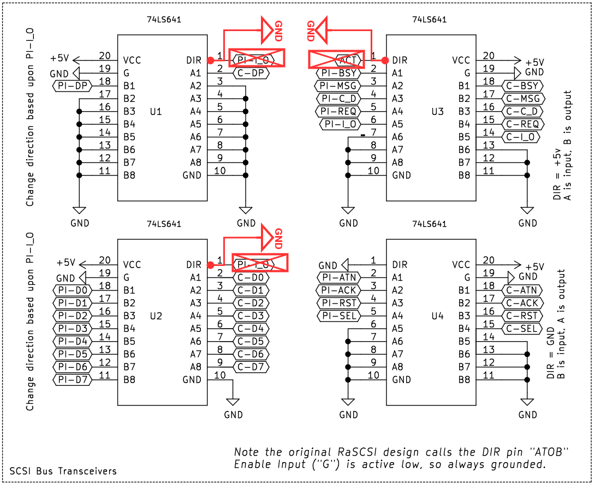
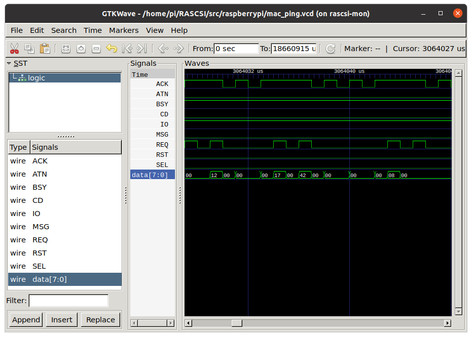

This page is intended for developers and/or advanced users only.

# What is scsimon?
The scsimon tool allows you to capture all of the traffic on the SCSI bus and log it to a file. The data is stored in a "Value Change Data" VCD file that can be read by GTKWave
```
+---------+    +-----------+    +----------+
|         |    |  PiSCSI   |    | Other    |
|  HOST   |    |  running  |    | SCSI     |
|   PC    |    |  scsimon  |    | device(s)|
|         |    |           |    |          |
+-+-------+    +--+-----+--+    +------+---+
  |               |     |              |
  +---------------+     +--------------+
    SCSI Bus              SCSI Bus
```

# Checkout and build scsimon

scsimon is included in the main installation of PiSCSI. It should be located in `/usr/local/bin/scsimon`. If its not, you may need to upgrade to a newer version of the PiSCSI software.

## Special PiSCSI 1.5/1.6 modification
If you're using a PiSCSI 2.x board ("FULLSPEC"), you do not need this modification!

If you're using a PiSCSI version 1.5 or 1.6, you will need to make the following modification to your board. This will force all of the transceivers into a RECEIVE-ONLY mode.

<a href="./images/scsimon_mods.png"></a>

# Capture data

Make sure you've stopped the PiSCSI service. Then run scsimon. If you're trying to capture a specific scenario, you'll want to wait to start scsimon until immediately before the scenario. 
```
sudo ./scsimon
```
Press CTRL-C when you're done capturing. You'll want to save the .VCD file.

# Reviewing data
Install GTKWave and launch it
```
sudo apt install gtkwave
gtkwave&
```

Once GTKWave launches, open the .VCD file that was captured by scsimon.
* First, double-click on the "logic" item in the Signal Search Tree (SST) frame.
* Double-click each of the signals that show up below the SST frame. This will add them to the Wave panel.
* Now, you should be able to see all of the data presented.

Note: There may be A LOT of zero data captured, since the SCSI bus may be sitting idle when you start the capture

<a href="./images/gtkwave.png"></a>